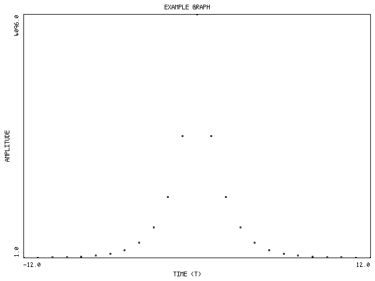

# Graf

A simple open source 2D graph creation tool.

    java -jar graf.jar -m x -x "-12 -11 -10 -9 -8 -7 -6 -5 -4 -3 -2 -1 0 1 2 \
    3 4 5 6 7 8 9 10 11 12" -y "1 2 4 8 16 32 64 128 256 512 1024 2048 4096 \
    2048 1024 512 256 128 64 32 16 8 4 2 1" -t "EXAMPLE GRAPH" "TIME (T)" \
    "AMPLITUDE" graph.png
